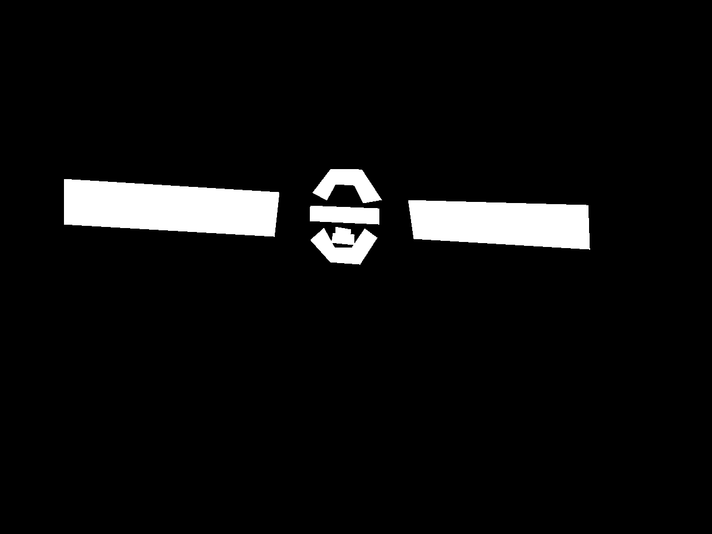
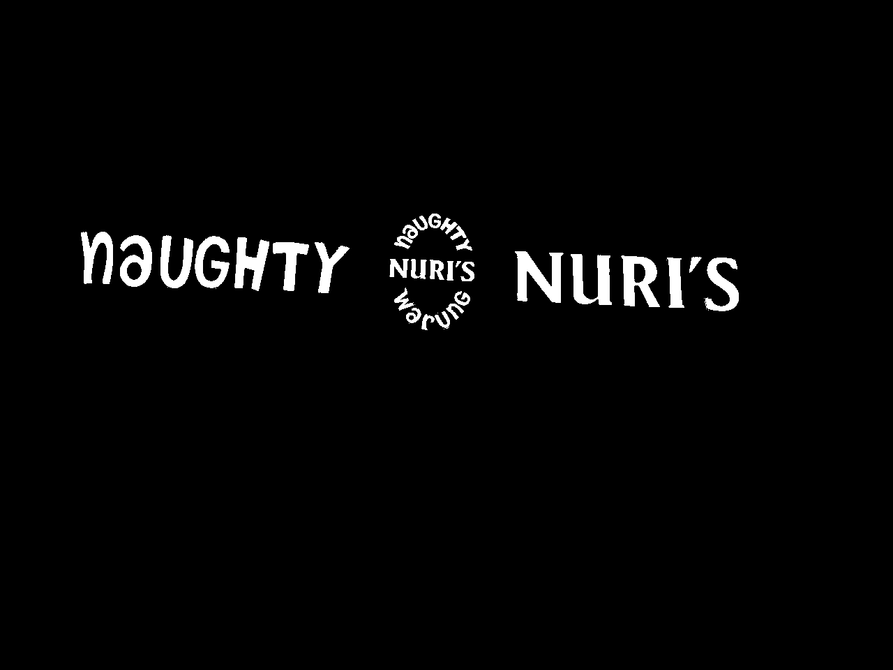
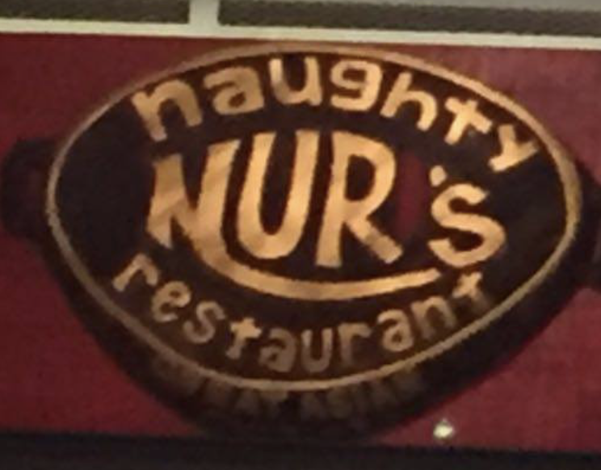
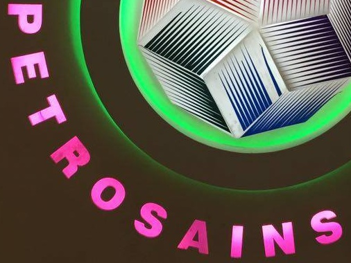
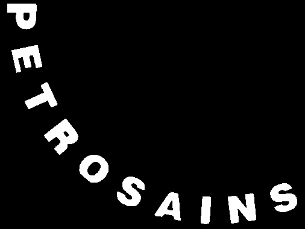

# Total Text Segmentation

##Origin total text data

* **Image (Test/Train)**

  Eg: img2.jpg

  

* **Region mask (Test/Train)**

  Eg:img2.jpg

  

* **Pixel mask (Test/Train)**

* Eg:img2.jpg

  

* **Ground truth (Test/Train):**

  Gt_box_x, Gt_box_y, label, type(curved, horizontal, ignore)：

  {'\_\_header\_\_': b'MATLAB 5.0 MAT-file, Platform: MACI64, Created on: Wed Oct  4 14:42:18 2017',
   '\_\_version\_\_': '1.0',
   '\_\_globals\_\_': [],
   'polygt': array([[array(['x:'], dtype='<U2'),
           array([[115, 503, 494, 115]], dtype=int16),
           array(['y:'], dtype='<U2'),
           array([[322, 346, 426, 404]], dtype=int16),
           array(['nauGHTY'], dtype='<U7'), array(['m'], dtype='<U1')],

  ​        [array(['x:'], dtype='<U2'),
  ​         array([[ 734, 1058, 1061,  744]], dtype=int16),
  ​         array(['y:'], dtype='<U2'),
  ​         array([[360, 369, 449, 430]], dtype=int16),
  ​         array(['NURIS'], dtype='<U5'), array(['m'], dtype='<U1')],

  ​     	 ... ...}

  

##My result

* **We can see that the region masks are in one-to-one correspondence to the gt_boxes, but the number of the pixel masks are less than the region masks. So I wrote a program to crop the images which have corresponding pixel masks.**

* **By the way, we cannot crop the pixel mask due to the region mask directly. Since that the curve text regions always have some disturbutions.**

  Eg: img3.jpg

  

  Cropped pixel mask of 'NURs'.

​		My pixel mask.

## Download

Aiming at generate the text segmentation dataset, I created these images. Download : [Google drive]().

The labels of the text are stored in the file name:

Eg:

*  img1_0_PETROSAINS.jpg

* img1_0_PETROSAINS_mask.jpg

## Acknowledge

My data is cropped from [total_text](https://github.com/cs-chan/Total-Text-Dataset). Thanks to cs-chan. 

I do not pursue any financial interest.
